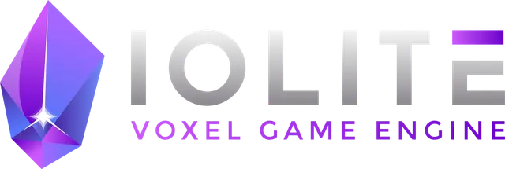

# Game Engines with Source: Learning from the best
-----------------------------------

As a game developer, I'm always intrigued by how other people do things and what solutions have been developed to some problem. As well as the big ones, many smaller engines are being worked on and I find myself downloading repositories, compiling, tinkering and marveling at what's available. This is a non-exhaustive list of game engines whose source code you can freely inspect, compile, run and learn from.

NB: When I say game engine I am referring to a conglomerate of technologies that generally has an editor, a scene description, input/output, etc. If the scope is more limited we would be talking about a rendering or a physics engine.

NB2: Notice I say public source, and not open or free or anything that suggests that you can arbitrarily make use of the code. Every entry in the list has its own licensing terms, commercial options and/or conditions that you need to abide by.

## Team Engines
Engines that are being developed by teams of individuals, generally are well established and have commercial products behind them.

|| Engine | Source | Screenshot |
| --- | :---: | --- | --- |
|| Unreal Engine | https://github.com/EpicGames/UnrealEngine ||
|| CryEngine | https://github.com/CRYTEK/CRYENGINE_ReadMe ||
|| Godot | https://github.com/godotengine/godot ||
|| The Forge | https://github.com/ConfettiFX/The-Forge ||
|| Torque 3D | https://github.com/TorqueGameEngines/Torque3D ||
|| Flax Engine | https://github.com/FlaxEngine/FlaxEngine ||
|| Panda 3D | https://github.com/panda3d/panda3d ||
|| Armory 3D | https://github.com/armory3d/armory ||
|| NeoAxis Engine | https://github.com/NeoAxis/NeoAxisEngine ||
|| Urho3D | https://github.com/urho3d/Urho3D ||
|| PlayCanvas Engine | https://github.com/playcanvas/engine |  |
|| Lumberyard | https://github.com/aws/lumberyard |  |
|| O3DE | https://github.com/o3de/o3de |  |
|| ezEngine | https://github.com/ezEngine/ezEngine |  |
|| Defold | https://github.com/defold/defold |  |
|| Cocos Creator | https://github.com/cocos/cocos-engine |  |
|| Stride | https://github.com/stride3d/stride |  |
|| Dagor | https://github.com/GaijinEntertainment/DagorEngine |  |
|| Range Engine |https://github.com/rangeengine/rangeengine.github.io |  |
|| IOLITE Voxel |https://github.com/MissingDeadlines/iolite |  |

## Solo Engines
Engines that are being developed generally by a single individual or at most a handful. Some are commercial products, others are often either experimental or toy pieces of tech.

|| Engine | Source | Screenshot |
| --- | :---: | --- | --- |
|| Raylib | https://github.com/raysan5/raylib ||
|| Wicked Engine | https://github.com/turanszkij/WickedEngine | |
|| Hazel | https://github.com/TheCherno/Hazel ||
|| Spartan Engine | https://github.com/PanosK92/SpartanEngine ||
|| Pax Engine | https://github.com/pmbittner/PaxEngine3 | |
||Acid Engine | https://github.com/EQMG/Acid |  |
|| rbfx | https://github.com/rokups/rbfx |  |
|| nCine | https://github.com/nCine/nCine |  |
|| Lina Engine | https://github.com/inanevin/LinaEngine |  |
|| VQE | https://github.com/vilbeyli/VQE ||
|| ET Engine | https://github.com/Illation/ETEngine |  |
|| Overload | https://github.com/adriengivry/Overload |  |
|| Mocha | https://github.com/mocha-engine/mocha |  |
|| Esoterica | https://github.com/BobbyAnguelov/Esoterica |  |
|| RBDoom3BFG | https://github.com/RobertBeckebans/RBDOOM-3-BFG |  |
|| Lumix Engine | https://github.com/nem0/LumixEngine ||
|| Ethereal Engine | https://github.com/volcoma/EtherealEngine ||
|| Lumos Engine | https://github.com/jmorton06/Lumos ||
|| Sir Engine | https://github.com/giordi91/SirEngineThe3rd |  |
|| PathFinder Engine | https://github.com/man-in-black382/PathFinder |  |
|| Thunder | https://github.com/thunder-engine/thunder |  |
|| Crown Engine | https://github.com/crownengine/crown |  |
|| Hyperion | https://github.com/krait-games/hyperion-engine |  |
|| VXR | https://github.com/avilapa/vxr |  |
|| AdriaDX12 | https://github.com/mateeeeeee/Adria-DX12 |  |
|| Hybrid | https://github.com/Angelo1211/HybridRenderingEngine |  |
|| Equilibrium Engine | https://github.com/clibequilibrium/EquilibriumEngine |  |
|| Koala Engine | https://github.com/phisko/kengine ||
|| Halley Engine | https://github.com/amzeratul/halley ||
|| Explosion Engine | https://github.com/ExplosionEngine/Explosion ||
|| Banshee Engine | https://github.com/ValtoGameEngines/Banshee-Engine ||
|| LiteFX | https://github.com/crud89/LiteFX | |

## Rendering Engines
These are only the graphics part of an engine but mature enough and well developed that their code is worthwhile to learn from.

|| Engine | Source |
| --- | :---: | --- |
|| Diligent Engine | https://github.com/DiligentGraphics/DiligentEngine |
|| bgfx| https://github.com/bkaradzic/bgfx |
|| Ogre 3D Next | https://github.com/OGRECave/ogre-next |
|| Methane Kit | https://github.com/egorodet/MethaneKit |
|| Magnum | https://github.com/mosra/magnum |
|| Vultaik | https://github.com/FaberSanZ/Vultaik |
|| Veldrid | https://github.com/mellinoe/veldrid |
